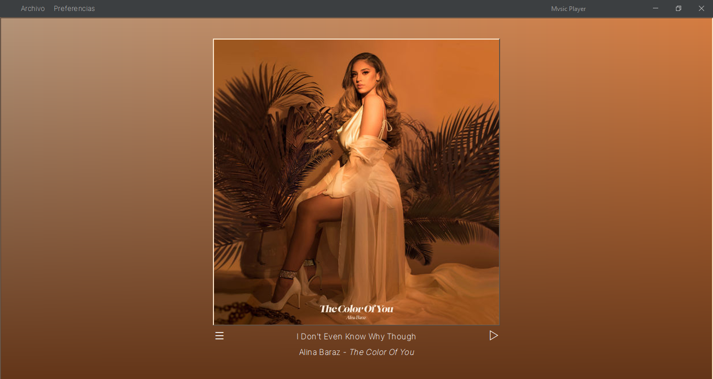
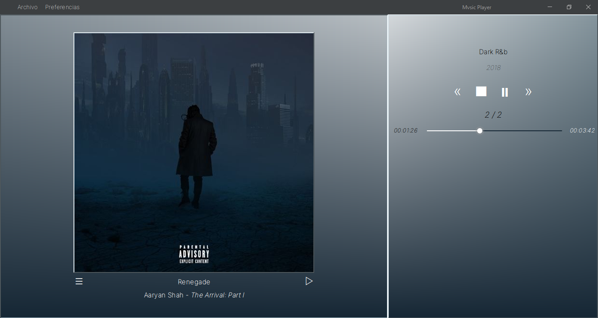

# Mvsic Player
Java Maven Music Player with beautiful UI and customization. 

Its development is based on [VLCJ Caprica](https://github.com/caprica/vlcj) framework and [Colorthief](https://lokeshdhakar.com/projects/color-thief/) library (among others).

By the moment you can play mp3, flac, wav, ogg, m4a and wma music files and get their metadata using [JAudioTagger](https://www.jthink.net/jaudiotagger/).

<b><i>Still in development</i></b>

NOTE: I am not responsible for the way/source of obtaining the files to play music using this software.

## Screenshoots

